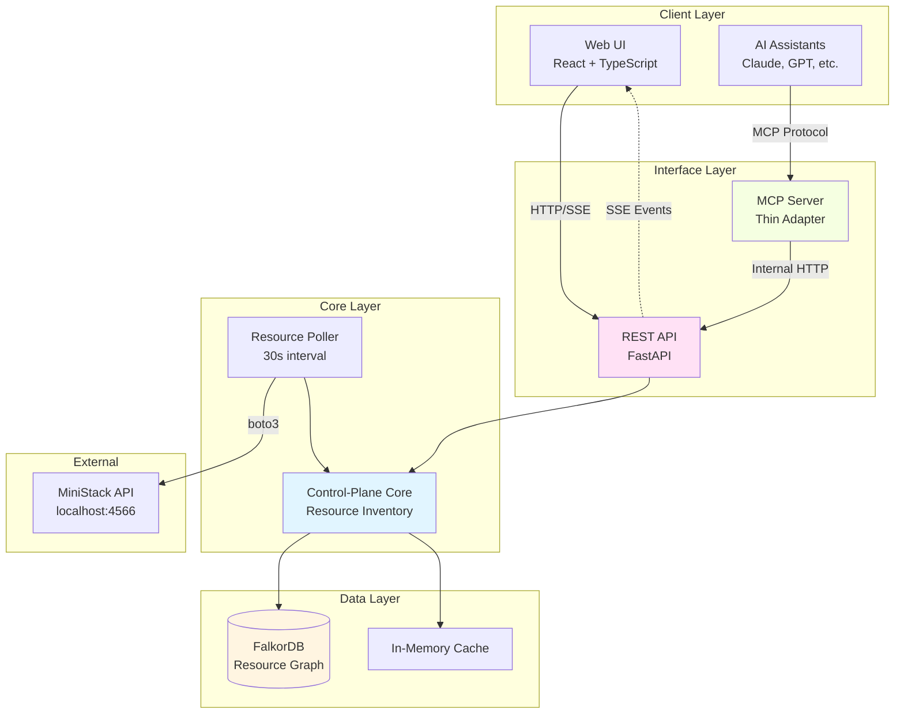
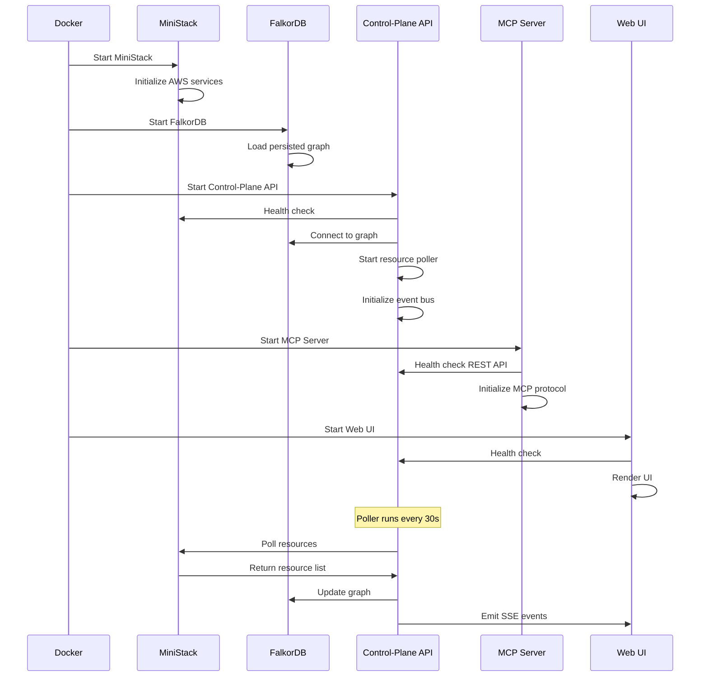

# Technical Architecture: MiniStack Console

**Project:** ministack_console  
**Version:** 1.5 (FINAL)  
**Date:** 2026-10-01  
**Status:** Ready for Approval  
**Author:** System Architect  
**Based on:** PRD v1.5 (FINAL)

---

## 1. Architecture Overview

MiniStack Console is a **dual-interface control-plane** for the MiniStack AWS emulator. It provides both human developers (via Web UI) and AI assistants (via MCP Server) with complete visibility and management capabilities for local AWS development environments.

### 1.1 System Architecture



### 1.2 Design Paradigm

**Layered Architecture with Hexagonal Core:**
- **Ports & Adapters Pattern:** Control-plane core exposes ports (interfaces), REST API and MCP Server are adapters
- **Single Source of Truth:** FalkorDB is the authoritative resource graph
- **Event-Driven Updates:** Resource changes flow through pub/sub to UI via SSE

---

## 2. Architecture Decisions

### AD-1: REST API as Core Backend
**Binds:** All business logic resides in REST API layer  
**Prevents:** Divergent logic in MCP Server vs Web UI  
**Rule:** MCP Server is a thin protocol adapter that translates MCP calls to REST API calls. No business logic in MCP Server.  
**Status:** [ADOPTED] (from PRD Q3 - MCP Adoption hedged bet)

### AD-2: FalkorDB for Resource Graph
**Binds:** All resource relationships and metadata stored in FalkorDB graph database  
**Prevents:** Inconsistent resource state across components  
**Rule:** FalkorDB is single source of truth for resource inventory, relationships, and control-plane tags. Redis-based, in-memory with persistence.  
**Status:** [ADOPTED] (from PRD Q1 - Graph Storage)

### AD-3: Dual Tagging System
**Binds:** Two parallel tagging systems serve different purposes  
**Prevents:** Tag conflicts between console organization and AWS compatibility  
**Rule:**
- **Control-Plane Tags:** Stored in FalkorDB, apply to ALL resources, used for project grouping and tenant management
- **Native MiniStack Tags:** Stored in MiniStack via AWS APIs, apply to services that support tagging (S3, EC2), used for AWS CLI/SDK compatibility  
**Status:** [ADOPTED] (from PRD Q4 - Resource Tagging)

### AD-4: Server-Sent Events for Real-time Updates
**Binds:** Real-time updates from control-plane to Web UI use SSE  
**Prevents:** Complex bidirectional WebSocket management for unidirectional data flow  
**Rule:** SSE for server→client streaming. HTTP for client→server commands. Built-in reconnect. FastAPI SSE endpoints.  
**Status:** [ADOPTED] (from PRD Q3 - Real-time Updates)

### AD-5: Python Backend with FastAPI
**Binds:** Backend written in Python using FastAPI framework  
**Prevents:** Language/framework fragmentation  
**Rule:** Python 3.11+, FastAPI 0.104+, boto3 for AWS SDK, type hints mandatory. Async/await patterns for I/O.  
**Status:** [ADOPTED] (from PRD Q2 - Backend Language)

### AD-6: Multi-Tenant Isolation by Access Key
**Binds:** Tenants identified by 12-digit MiniStack access key  
**Prevents:** Cross-tenant data leakage  
**Rule:** Every resource has `tenant_id` property. All queries filter by tenant. UI has tenant selector dropdown. MiniStack access key = tenant boundary.  
**Status:** [ADOPTED] (from PRD)

### AD-7: AWS Console Clone UI Paradigm
**Binds:** Web UI replicates AWS Console information architecture and workflows  
**Prevents:** Unfamiliar UX for AWS developers  
**Rule:** Service pages structured like AWS Console equivalents. Consistent with AWS terminology. Familiar layouts (list→detail→create pattern).  
**Status:** [ADOPTED] (from PRD Q6a - UI Paradigm)

### AD-8: Resource Polling Strategy
**Binds:** Control-plane polls MiniStack API every 30 seconds  
**Prevents:** Stale resource state vs real-time overhead trade-off  
**Rule:** Background poller runs on 30s interval (configurable). Incremental updates only (detect changes, not full scan). Detects MiniStack restarts and re-inventories.  
**Status:** [ADOPTED] (from PRD)

### AD-9: MCP Comprehensive Capabilities
**Binds:** MCP tools support full workflow: CRUD + bulk + troubleshooting + templating + audit  
**Prevents:** Limited AI assistant capabilities  
**Rule:**
- **Phase 1:** Basic CRUD (create/update/delete resources) + Bulk operations (`bulk_create_stack`)
- **Phase 2:** Troubleshooting (`diagnose_access_issue`), Templating (`clone_project`), Audit (`get_recent_changes`)  
**Status:** [ADOPTED] (from PRD Q6b - MCP Use Cases)

### AD-10: Docker-First Deployment
**Binds:** Primary deployment via Docker Compose  
**Prevents:** Environment setup complexity  
**Rule:** Docker Compose includes MiniStack + FalkorDB + Control-Plane + MCP + Web UI. Single `docker-compose up` command. Standalone binary deferred to Phase 2.  
**Status:** [ADOPTED] (from PRD Q4 - Deployment Model)

### AD-11: Hybrid Schema Evolution Strategy
**Binds:** FalkorDB schema evolution uses hybrid approach  
**Prevents:** Schema migration complexity vs. flexibility trade-off  
**Rule:**
- **Core Structure (Fixed):** Node types (Tenant, Project, Resource, ServiceType) and relationships (OWNS, CONTAINS, DEPENDS_ON, TAGGED_WITH) are stable. Changes require migration script.
- **Resource Metadata (Flexible):** Each Resource node has JSON `state` property containing service-specific metadata. No schema enforcement on `state` content. Allows adding new fields without migration.
- **New Service Types (Additive):** New ServiceType nodes added as services are implemented. Forward-compatible. No migration needed.
- **Structural Changes (Rare):** Migration scripts only for core structure changes. Document in `.harness/decisions/`. Provide backward compatibility or clear upgrade path.  
**Status:** [ADOPTED] (OQ-1 resolved)

### AD-12: Hybrid Polling Error Handling
**Binds:** Resource polling failures handled with retry + staleness + alert strategy  
**Prevents:** Silent inventory staleness and poor user experience during failures  
**Rule:**
- **Retry Logic (Transient Failures):** 2 retries per poll cycle with exponential backoff (1s, 2s). Reset failure counter on success.
- **Staleness Marker (Persistent Issues):** After 3 consecutive failures (90 seconds), mark resources as "stale". UI shows yellow badge with timestamp of last successful poll. Data still displayed but flagged as potentially outdated.
- **Alert System (Critical Failures):** After 5 consecutive failures (2.5 minutes), show UI alert banner: "MiniStack connection issues - [Service Name] unavailable". Provide "Retry Now" button for manual re-poll. Alert auto-dismisses on recovery.
- **Auto-Recovery Detection:** On next successful poll after failures, clear stale markers. Detect MiniStack restart via health check endpoint. Full re-sync on recovery.  
**Status:** [ADOPTED] (OQ-2 resolved)

### AD-13: Transactional Checkpoint for MCP Bulk Operations
**Binds:** MCP bulk operations use transactional checkpoint pattern with confirm/rollback/continue options  
**Prevents:** Orphaned resources and poor error recovery UX for AI assistants  
**Rule:**
- **Phase 1 (Begin):** `bulk_create_stack_begin(resources)` creates resources sequentially with checkpoints. On failure, stops and returns: `transaction_id`, `succeeded` (list), `failed` (resource + error), `pending` (not attempted).
- **Phase 2 (Action):** AI chooses: `bulk_create_stack_confirm(tx_id)` keeps created resources, `bulk_create_stack_rollback(tx_id)` deletes all created resources, `bulk_create_stack_continue(tx_id, fixed_resource)` retries from checkpoint.
- **Auto-Cleanup:** Transactions expire after 5 minutes if not confirmed/rolled back. Expired transactions auto-rollback to prevent orphaned resources.
- **Transaction State:** Stored in FalkorDB with created resource IDs for rollback. Transaction log includes all operations for audit.  
**Status:** [ADOPTED] (OQ-3 resolved)

### AD-14: Hybrid LocalStorage for UI State Persistence
**Binds:** UI state persists in browser LocalStorage with smart auto-clear rules  
**Prevents:** Poor UX for returning users vs. state management complexity trade-off  
**Rule:**
- **Store in LocalStorage:** Selected tenant ID, active filters (project, tags, service type), table sorting (column, direction), view preferences (list/grid, items per page), last visited page/service.
- **Auto-Clear Rules:** Tenant change clears all filters (tenant-specific). Service switch clears service-specific filters. Manual reset via "Reset to Defaults" button. Expired state (>30 days) auto-cleared.
- **Namespace by Tenant:** Key format `ministack-console:{tenant-id}:{setting}` prevents filter bleed across tenants.
- **Graceful Degradation:** If LocalStorage unavailable (privacy mode), fall back to in-memory state without errors.
- **User Controls:** "Reset to Defaults" button in settings. Clear indication when filters applied with "Clear" option. Toast notification: "Restored your previous session".
- **Phase 2 Enhancement:** Optional server-side sync when auth system built. LocalStorage as cache, server as source of truth.  
**Status:** [ADOPTED] (OQ-4 resolved)

### AD-15: PyInstaller Standalone Binary Packaging
**Binds:** Phase 2 standalone binary uses PyInstaller + embedded static files  
**Prevents:** Complex multi-component packaging vs. true single executable trade-off  
**Rule:**
- **Backend Packaging:** Package FastAPI backend with PyInstaller. Bundle all Python dependencies (boto3, FastAPI, etc.). Embed React static build as data files. Single executable per platform.
- **FalkorDB Handling:** Bundle separate FalkorDB binary, start as subprocess from main executable. Alternative: embedded Redis fork if size permits. Fallback: SQLite with graph extensions.
- **Static File Serving:** React build embedded in PyInstaller bundle. FastAPI serves static files from embedded resources. No separate web server needed.
- **Build Process:** Automated builds via GitHub Actions. Platform-specific binaries: macOS (arm64 + x86_64), Linux (x86_64), Windows (x86_64). Sign macOS/Windows binaries for security.
- **Size Optimization:** Strip debug symbols. Compress with UPX where possible. Target: ~80-100MB (within <100MB requirement).
- **Deliverables:** `ministack-console-macos-arm64`, `ministack-console-macos-x86_64`, `ministack-console-linux-x86_64`, `ministack-console-windows-x86_64.exe`.  
**Status:** [ADOPTED] (OQ-5 resolved)

---

## 3. Component Architecture

### 3.1 Control-Plane Core

**Responsibility:** Resource inventory, graph maintenance, multi-tenant isolation

**Module Structure:**
```
control_plane/
├── inventory/
│   ├── poller.py          # MiniStack polling logic
│   ├── detector.py        # Change detection
│   └── sync.py            # Inventory sync to FalkorDB
├── graph/
│   ├── schema.py          # FalkorDB schema definition
│   ├── query.py           # Graph query operations
│   └── relationships.py   # Dependency detection
├── tagging/
│   ├── control_plane.py   # Control-plane tags (FalkorDB)
│   └── native.py          # Native MiniStack tags (boto3)
└── tenants/
    ├── isolation.py       # Tenant boundary enforcement
    └── switcher.py        # Tenant context management
```

**Resource Poller Algorithm:**
```python
async def poll_ministack():
    while True:
        try:
            # 1. Health check MiniStack
            if not ministack_healthy():
                await detect_restart()
                continue
            
            # 2. Poll each service (S3, Lambda, DynamoDB, etc.)
            for service in enabled_services:
                resources = await fetch_resources(service)
                changes = detect_changes(resources, last_snapshot)
                
                # 3. Update inventory
                for change in changes:
                    if change.type == "CREATED":
                        await inventory.add_resource(change.resource)
                    elif change.type == "MODIFIED":
                        await inventory.update_resource(change.resource)
                    elif change.type == "DELETED":
                        await inventory.delete_resource(change.resource_id)
                    
                    # 4. Emit event for SSE
                    await event_bus.publish(change)
            
            # 5. Detect dependencies
            await graph.detect_dependencies()
            
            await asyncio.sleep(30)  # Configurable interval
        except Exception as e:
            logger.error(f"Poll error: {e}")
            await asyncio.sleep(5)
```

**Dependency Detection:**
- **Lambda → S3:** Parse environment variables, IAM policy ARNs
- **Lambda → SQS/SNS:** Parse event source mappings
- **S3 → IAM:** Parse bucket policies, ACLs
- **CloudFormation → Resources:** Parse stack resources

---

### 3.2 REST API (FastAPI)

**Responsibility:** Core backend, business logic, CRUD operations

**API Structure:**
```
api/
├── main.py                # FastAPI app, middleware
├── routes/
│   ├── resources.py       # /api/resources/* endpoints
│   ├── tenants.py         # /api/tenants/* endpoints
│   ├── projects.py        # /api/projects/* endpoints
│   ├── graph.py           # /api/graph/* endpoints
│   └── sse.py             # /api/sse endpoint
├── services/
│   ├── s3.py              # S3 CRUD operations
│   ├── lambda_.py         # Lambda CRUD operations
│   ├── dynamodb.py        # DynamoDB CRUD operations
│   └── ...                # Other service implementations
├── models/
│   ├── resource.py        # Pydantic models
│   ├── tenant.py
│   └── project.py
└── middleware/
    ├── auth.py            # API key authentication
    ├── rate_limit.py      # Rate limiting
    └── tenant_context.py  # Tenant isolation
```

**Key Endpoints:**

| Endpoint | Method | Description |
|----------|--------|-------------|
| `/api/tenants` | GET | List all tenants |
| `/api/tenants/{tenant_id}/resources` | GET | List resources in tenant |
| `/api/tenants/{tenant_id}/projects` | GET | List projects in tenant |
| `/api/projects/{project_name}/resources` | GET | List resources in project |
| `/api/resources/s3/buckets` | GET | List all S3 buckets |
| `/api/resources/s3/buckets` | POST | Create S3 bucket |
| `/api/resources/s3/buckets/{name}` | GET | Get bucket details |
| `/api/resources/s3/buckets/{name}` | DELETE | Delete bucket |
| `/api/resources/lambda/functions` | GET, POST | Lambda functions |
| `/api/resources/dynamodb/tables` | GET, POST | DynamoDB tables |
| `/api/graph/dependencies` | GET | Query resource dependencies |
| `/api/graph/dependents` | GET | Query resource dependents |
| `/api/sse` | GET | SSE event stream |

**Request/Response Format:**
```json
// GET /api/resources/s3/buckets
{
  "resources": [
    {
      "id": "bucket-123",
      "type": "s3:bucket",
      "name": "my-bucket",
      "tenant_id": "123456789012",
      "project": "microservice-a",
      "tags": {
        "control_plane": {"environment": "dev", "team": "backend"},
        "native": {"Name": "my-bucket", "CostCenter": "engineering"}
      },
      "created_at": "2026-10-01T12:00:00Z",
      "state": {
        "versioning": "Enabled",
        "region": "us-east-1"
      }
    }
  ],
  "pagination": {
    "next": "/api/resources/s3/buckets?page=2",
    "total": 42
  }
}

// POST /api/resources/s3/buckets
{
  "name": "new-bucket",
  "tenant_id": "123456789012",
  "project": "microservice-b",
  "tags": {
    "environment": "dev"
  },
  "versioning": true
}
```

**Authentication:**
- **Web UI:** Session-based (no multi-user in Phase 1, single developer tool)
- **MCP Server:** API key-based (`X-API-Key` header)
- API keys generated via UI, stored in FalkorDB

**Rate Limiting:**
- **Read operations:** 1000 requests/minute per tenant
- **Write operations:** 100 requests/minute per tenant (MCP limit from PRD)
- **SSE connections:** 10 concurrent per tenant

---

### 3.3 MCP Server

**Responsibility:** Thin adapter translating MCP protocol to REST API calls

**Architecture:**
```
mcp_server/
├── main.py                # MCP server entry point
├── adapter.py             # MCP → REST translation
├── tools/
│   ├── crud.py            # Basic CRUD tools
│   ├── bulk.py            # Bulk operations
│   ├── troubleshoot.py    # Troubleshooting tools (Phase 2)
│   ├── template.py        # Templating tools (Phase 2)
│   └── audit.py           # Audit tools (Phase 2)
├── resources.py           # MCP resources definition
└── prompts.py             # MCP prompts definition
```

**MCP Protocol Implementation:**

```python
from mcp import Server, Tool, Resource

server = Server("ministack-console")

# MCP Resources (Read Operations)
@server.resource("ministack://tenants")
async def list_tenants(context):
    # Call REST API
    resp = await rest_client.get("/api/tenants")
    return resp.json()

@server.resource("ministack://tenant/{tenant_id}/resources")
async def list_tenant_resources(context, tenant_id):
    resp = await rest_client.get(f"/api/tenants/{tenant_id}/resources")
    return resp.json()

@server.resource("ministack://resources/s3/buckets")
async def list_s3_buckets(context):
    resp = await rest_client.get("/api/resources/s3/buckets")
    return resp.json()

# MCP Tools (Write Operations - Phase 1)
@server.tool("create_s3_bucket")
async def create_s3_bucket(context, name: str, tenant_id: str, 
                          project: str = None, versioning: bool = False):
    """Create an S3 bucket in MiniStack"""
    resp = await rest_client.post("/api/resources/s3/buckets", json={
        "name": name,
        "tenant_id": tenant_id,
        "project": project,
        "versioning": versioning
    })
    return resp.json()

@server.tool("delete_s3_bucket")
async def delete_s3_bucket(context, name: str, tenant_id: str, force: bool = False):
    """Delete an S3 bucket"""
    resp = await rest_client.delete(f"/api/resources/s3/buckets/{name}",
                                    params={"force": force})
    return resp.json()

@server.tool("bulk_create_stack")
async def bulk_create_stack(context, stack_definition: dict, 
                           tenant_id: str, project: str):
    """Create multiple resources from a stack definition"""
    # Example stack_definition:
    # {
    #   "resources": [
    #     {"type": "s3:bucket", "name": "uploads", "versioning": true},
    #     {"type": "sqs:queue", "name": "tasks", "retention": 86400},
    #     {"type": "lambda:function", "name": "processor", "runtime": "python3.11"}
    #   ]
    # }
    resp = await rest_client.post("/api/bulk/stack", json={
        "stack": stack_definition,
        "tenant_id": tenant_id,
        "project": project
    })
    return resp.json()

# MCP Tools (Phase 2 - Deferred)
@server.tool("diagnose_access_issue")
async def diagnose_access_issue(context, source_resource: str, 
                                target_resource: str):
    """Diagnose why one resource can't access another"""
    # TODO: Phase 2 implementation
    pass

@server.tool("clone_project")
async def clone_project(context, source_project: str, 
                       target_project: str, tenant_id: str):
    """Clone all resources from one project to another"""
    # TODO: Phase 2 implementation
    pass
```

**MCP Server Configuration:**
```yaml
# mcp-config.yaml
server:
  name: ministack-console
  version: 1.0.0
  port: 3100
  
rest_api:
  base_url: http://localhost:3001
  timeout: 30
  
auth:
  api_key_header: X-API-Key
  
rate_limits:
  read_ops: 1000  # per minute
  write_ops: 100   # per minute
```

---

### 3.4 Web UI (React + TypeScript)

**Responsibility:** AWS Console-style UI for human developers

**Component Architecture:**
```
web_ui/
├── src/
│   ├── App.tsx
│   ├── components/
│   │   ├── layout/
│   │   │   ├── Header.tsx         # AWS Console-style header
│   │   │   ├── Sidebar.tsx        # Service navigation
│   │   │   └── TenantSwitcher.tsx # Tenant dropdown
│   │   ├── common/
│   │   │   ├── Table.tsx          # Reusable data table
│   │   │   ├── Form.tsx           # Form components
│   │   │   └── Modal.tsx          # Modal dialogs
│   │   └── services/
│   │       ├── S3/
│   │       │   ├── BucketList.tsx
│   │       │   ├── BucketDetail.tsx
│   │       │   ├── BucketCreate.tsx
│   │       │   └── ObjectBrowser.tsx
│   │       ├── Lambda/
│   │       │   ├── FunctionList.tsx
│   │       │   ├── FunctionDetail.tsx
│   │       │   ├── FunctionCreate.tsx
│   │       │   └── CodeEditor.tsx
│   │       └── DynamoDB/
│   │           ├── TableList.tsx
│   │           ├── TableDetail.tsx
│   │           ├── TableCreate.tsx
│   │           └── ItemBrowser.tsx
│   ├── hooks/
│   │   ├── useSSE.ts              # SSE real-time updates
│   │   ├── useResources.ts        # Resource CRUD operations
│   │   └── useTenant.ts           # Tenant context
│   ├── services/
│   │   ├── api.ts                 # REST API client
│   │   └── sse.ts                 # SSE client
│   ├── store/
│   │   ├── index.ts               # State management (Zustand/Redux)
│   │   ├── resourcesSlice.ts
│   │   └── tenantSlice.ts
│   └── types/
│       ├── resource.ts
│       ├── tenant.ts
│       └── api.ts
└── package.json
```

**SSE Client Implementation:**
```typescript
// hooks/useSSE.ts
import { useEffect } from 'react';
import { useResourceStore } from '../store';

export function useSSE(tenantId: string) {
  const { updateResource, deleteResource } = useResourceStore();
  
  useEffect(() => {
    const eventSource = new EventSource(
      `http://localhost:3001/api/sse?tenant_id=${tenantId}`
    );
    
    eventSource.onmessage = (event) => {
      const change = JSON.parse(event.data);
      
      if (change.type === 'RESOURCE_CREATED' || change.type === 'RESOURCE_UPDATED') {
        updateResource(change.resource);
      } else if (change.type === 'RESOURCE_DELETED') {
        deleteResource(change.resource_id);
      }
    };
    
    eventSource.onerror = () => {
      // Auto-reconnect handled by EventSource
      console.error('SSE connection error');
    };
    
    return () => eventSource.close();
  }, [tenantId]);
}
```

**AWS Console Clone Patterns:**

1. **Service Page Structure:**
   - List view with search/filter
   - Create button (top-right, orange like AWS)
   - Actions dropdown for bulk operations
   - Detail view with tabs (Overview, Tags, Permissions, etc.)

2. **Navigation:**
   - Left sidebar with service groups (Compute, Storage, Database, etc.)
   - Breadcrumbs showing current location
   - Recent services list

3. **Terminology:**
   - Use AWS terms: "Bucket" not "Container", "Function" not "Serverless App"
   - Action names: "Create", "Delete", "Modify" (AWS verbs)

4. **Styling:**
   - AWS-inspired color scheme (blue header, white content, orange CTAs)
   - Monospaced fonts for ARNs, IDs
   - Table layouts matching AWS Console density

---

## 4. Data Architecture

### 4.1 FalkorDB Schema

**Graph Model:**
```cypher
// Node Types
(:Tenant {id, name, created_at})
(:Project {name, description, tenant_id, created_at})
(:Resource {
    id,              // Unique resource ID
    type,            // e.g., "s3:bucket", "lambda:function"
    name,            // Resource name
    tenant_id,       // Owner tenant
    arn,             // AWS ARN format
    state,           // JSON blob of resource state
    created_at,
    updated_at
})
(:ServiceType {name, category})

// Relationship Types
(:Tenant)-[:OWNS]->(:Project)
(:Project)-[:CONTAINS]->(:Resource)
(:Resource)-[:DEPENDS_ON]->(:Resource)
(:Resource)-[:TAGGED_WITH {key, value}]->(:Tag)
(:Resource)-[:INSTANCE_OF]->(:ServiceType)

// Indexes
CREATE INDEX tenant_id ON Resource(tenant_id)
CREATE INDEX resource_type ON Resource(type)
CREATE INDEX resource_name ON Resource(name)
CREATE INDEX project_name ON Project(name)
```

**Example Queries:**
```cypher
// Find all resources in a project
MATCH (p:Project {name: 'microservice-a'})-[:CONTAINS]->(r:Resource)
RETURN r

// Find dependencies of a Lambda function
MATCH (lambda:Resource {type: 'lambda:function', name: 'processor'})-[:DEPENDS_ON]->(dep:Resource)
RETURN dep

// Find what depends on an S3 bucket
MATCH (r:Resource)-[:DEPENDS_ON]->(bucket:Resource {type: 's3:bucket', name: 'uploads'})
RETURN r

// Find all resources in a tenant
MATCH (t:Tenant {id: '123456789012'})-[:OWNS]->(p:Project)-[:CONTAINS]->(r:Resource)
RETURN r
```

### 4.2 Dual Tagging System

**Control-Plane Tags (FalkorDB):**
- Stored as properties on `(:Resource)` nodes or `(:Resource)-[:TAGGED_WITH]->(:Tag)` relationships
- Apply to ALL resources, all services
- Used for project grouping, tenant management, search/filter
- Example: `{project: "microservice-a", environment: "dev", team: "backend"}`

**Native MiniStack Tags (AWS APIs):**
- Stored in MiniStack via boto3 calls (e.g., `s3.put_bucket_tagging()`)
- Apply only to services that support native tagging (S3, EC2, Lambda, etc.)
- Used for AWS CLI/SDK compatibility
- Example: `{Name: "my-bucket", CostCenter: "engineering"}`

**Write-Through Strategy:**
```python
async def tag_resource(resource_id: str, tags: dict, tag_type: str):
    resource = await graph.get_resource(resource_id)
    
    if tag_type == "control_plane":
        # Always write to FalkorDB
        await graph.add_tags(resource_id, tags)
    
    elif tag_type == "native":
        # Write to FalkorDB + MiniStack (if supported)
        await graph.add_tags(resource_id, tags, namespace="native")
        
        if resource.type in TAGGABLE_SERVICES:
            await ministack_client.tag_resource(resource, tags)
    
    # Emit SSE event
    await event_bus.publish("RESOURCE_TAGGED", resource_id, tags)
```

**UI Display:**
```tsx
<TagList>
  <TagSection title="Control-Plane Tags">
    {resource.tags.control_plane.map(tag => (
      <Tag key={tag.key} label={tag.key} value={tag.value} 
           editable={true} />
    ))}
  </TagSection>
  
  <TagSection title="MiniStack Native Tags">
    {resource.tags.native.map(tag => (
      <Tag key={tag.key} label={tag.key} value={tag.value}
           editable={resource.type in TAGGABLE_SERVICES} />
    ))}
  </TagSection>
</TagList>
```

---

## 5. Integration Architecture

### 5.1 MiniStack Integration

**boto3 Patterns:**
```python
import boto3
from botocore.config import Config

# MiniStack client configuration
config = Config(
    region_name='us-east-1',
    signature_version='s3v4',
    retries={'max_attempts': 3}
)

session = boto3.Session(
    aws_access_key_id=tenant_access_key,  # 12-digit MiniStack tenant ID
    aws_secret_access_key='dummy',
    region_name='us-east-1'
)

# Service clients
s3 = session.client('s3', endpoint_url='http://localhost:4566', config=config)
lambda_client = session.client('lambda', endpoint_url='http://localhost:4566')
dynamodb = session.resource('dynamodb', endpoint_url='http://localhost:4566')
```

**Resource Polling Implementation:**
```python
async def poll_s3_resources(tenant_id: str):
    """Poll S3 buckets for a tenant"""
    client = get_ministack_client('s3', tenant_id)
    
    try:
        # List buckets
        response = client.list_buckets()
        buckets = response.get('Buckets', [])
        
        for bucket in buckets:
            bucket_name = bucket['Name']
            
            # Get bucket details
            try:
                location = client.get_bucket_location(Bucket=bucket_name)
                versioning = client.get_bucket_versioning(Bucket=bucket_name)
                tags = client.get_bucket_tagging(Bucket=bucket_name).get('TagSet', [])
            except ClientError:
                # Bucket may not have versioning/tags
                pass
            
            # Build resource object
            resource = {
                'id': f"s3-bucket-{bucket_name}",
                'type': 's3:bucket',
                'name': bucket_name,
                'tenant_id': tenant_id,
                'arn': f"arn:aws:s3:::{bucket_name}",
                'state': {
                    'location': location,
                    'versioning': versioning,
                },
                'tags': {
                    'native': {tag['Key']: tag['Value'] for tag in tags}
                },
                'created_at': bucket['CreationDate'].isoformat()
            }
            
            # Sync to inventory
            await inventory.sync_resource(resource)
    
    except ClientError as e:
        logger.error(f"Error polling S3 for tenant {tenant_id}: {e}")
```

**MiniStack Internal API Usage:**
```python
import httpx

async def check_ministack_health():
    """Check if MiniStack is running and responsive"""
    try:
        resp = await httpx.get('http://localhost:4566/_ministack/health', timeout=5)
        return resp.status_code == 200
    except httpx.RequestError:
        return False

async def detect_ministack_restart():
    """Detect if MiniStack was restarted (state cleared)"""
    resp = await httpx.get('http://localhost:4566/_ministack/config')
    config = resp.json()
    
    # Check if startup timestamp changed
    if config.get('startup_time') != last_known_startup:
        logger.warning("MiniStack restart detected, re-inventorying...")
        await full_reinventory()
```

### 5.2 Real-time Updates (SSE)

**Event Bus Architecture:**
```python
# event_bus.py
from typing import Callable, Dict, List
import asyncio

class EventBus:
    def __init__(self):
        self.subscribers: Dict[str, List[asyncio.Queue]] = {}
    
    async def subscribe(self, tenant_id: str) -> asyncio.Queue:
        """Subscribe to events for a tenant"""
        queue = asyncio.Queue()
        if tenant_id not in self.subscribers:
            self.subscribers[tenant_id] = []
        self.subscribers[tenant_id].append(queue)
        return queue
    
    async def unsubscribe(self, tenant_id: str, queue: asyncio.Queue):
        """Unsubscribe from events"""
        if tenant_id in self.subscribers:
            self.subscribers[tenant_id].remove(queue)
    
    async def publish(self, event_type: str, resource: dict):
        """Publish an event to all subscribers of this tenant"""
        tenant_id = resource.get('tenant_id')
        if tenant_id in self.subscribers:
            event = {
                'type': event_type,
                'resource': resource,
                'timestamp': datetime.utcnow().isoformat()
            }
            
            for queue in self.subscribers[tenant_id]:
                await queue.put(event)

event_bus = EventBus()
```

**FastAPI SSE Endpoint:**
```python
from fastapi import APIRouter, Query
from fastapi.responses import StreamingResponse
import asyncio

router = APIRouter()

@router.get("/api/sse")
async def sse_endpoint(tenant_id: str = Query(...)):
    """Server-Sent Events stream for real-time updates"""
    
    async def event_generator():
        queue = await event_bus.subscribe(tenant_id)
        
        try:
            while True:
                # Wait for next event
                event = await queue.get()
                
                # Format as SSE
                yield f"data: {json.dumps(event)}\n\n"
        
        except asyncio.CancelledError:
            await event_bus.unsubscribe(tenant_id, queue)
            raise
    
    return StreamingResponse(
        event_generator(),
        media_type="text/event-stream",
        headers={
            "Cache-Control": "no-cache",
            "Connection": "keep-alive",
        }
    )
```

**Event Types:**
- `RESOURCE_CREATED`: New resource discovered
- `RESOURCE_UPDATED`: Resource state changed
- `RESOURCE_DELETED`: Resource removed
- `DEPENDENCY_ADDED`: New dependency detected
- `DEPENDENCY_REMOVED`: Dependency no longer exists
- `TAGS_UPDATED`: Resource tags changed

---

## 6. Deployment Architecture

### 6.1 Docker Compose Setup

**docker-compose.yml:**
```yaml
version: '3.8'

services:
  # MiniStack AWS Emulator
  ministack:
    image: localstack/localstack:latest
    container_name: ministack
    ports:
      - "4566:4566"
    environment:
      - SERVICES=s3,lambda,dynamodb,sqs,sns,cloudwatch,iam,ec2,rds,ecs
      - DEBUG=1
      - PERSISTENCE=1
    volumes:
      - ministack-data:/var/lib/localstack
      - /var/run/docker.sock:/var/run/docker.sock
  
  # FalkorDB Graph Database
  falkordb:
    image: falkordb/falkordb:latest
    container_name: falkordb
    ports:
      - "6379:6379"
    volumes:
      - falkordb-data:/data
    command: ["redis-server", "--appendonly", "yes"]
  
  # Control-Plane API (FastAPI)
  api:
    build:
      context: ./backend
      dockerfile: Dockerfile
    container_name: ministack-api
    ports:
      - "3001:3001"
    environment:
      - MINISTACK_ENDPOINT=http://ministack:4566
      - FALKORDB_HOST=falkordb
      - FALKORDB_PORT=6379
      - LOG_LEVEL=INFO
    depends_on:
      - ministack
      - falkordb
    volumes:
      - ./backend:/app
      - api-cache:/app/.cache
  
  # MCP Server
  mcp:
    build:
      context: ./mcp-server
      dockerfile: Dockerfile
    container_name: ministack-mcp
    ports:
      - "3100:3100"
    environment:
      - REST_API_URL=http://api:3001
      - MCP_PORT=3100
    depends_on:
      - api
    volumes:
      - ./mcp-server:/app
  
  # Web UI (React)
  ui:
    build:
      context: ./web-ui
      dockerfile: Dockerfile
    container_name: ministack-ui
    ports:
      - "3000:3000"
    environment:
      - REACT_APP_API_URL=http://localhost:3001
      - REACT_APP_SSE_URL=http://localhost:3001/api/sse
    depends_on:
      - api
    volumes:
      - ./web-ui:/app
      - /app/node_modules

volumes:
  ministack-data:
  falkordb-data:
  api-cache:

networks:
  default:
    name: ministack-console-network
```

### 6.2 Configuration Management

**config.yaml:**
```yaml
# MiniStack Console Configuration

ministack:
  endpoint: http://localhost:4566
  internal_api: http://localhost:4566/_ministack
  region: us-east-1
  
falkordb:
  host: localhost
  port: 6379
  database: 0
  
api:
  host: 0.0.0.0
  port: 3001
  cors_origins:
    - http://localhost:3000
  
mcp:
  host: 0.0.0.0
  port: 3100
  api_key_required: true
  
polling:
  interval_seconds: 30
  enabled_services:
    - s3
    - lambda
    - dynamodb
    - sqs
    - sns
    - cloudwatch
  
ui:
  host: 0.0.0.0
  port: 3000
  
logging:
  level: INFO
  format: json
```

### 6.3 Service Startup Sequence



---

## 7. Security & Performance

### 7.1 Security Controls

**Authentication:**
- **Web UI:** Single-user dev tool (Phase 1), no authentication required
- **MCP Server:** API key-based authentication
  - API keys generated via Web UI
  - Stored in FalkorDB with hashed values
  - Passed in `X-API-Key` header
  - Rate-limited per key

**Tenant Isolation:**
- All queries filter by `tenant_id`
- FalkorDB queries enforce tenant boundary
- No cross-tenant data leakage
- Tenant context propagated through all layers

**Audit Logging:**
- All write operations logged (create, update, delete)
- Log entries include: timestamp, tenant, user (API key), operation, resource, outcome
- Stored in FalkorDB as `(:AuditLog)` nodes
- Queryable via REST API and MCP

**No External Dependencies:**
- All data stays local (no cloud services)
- No external API calls
- No telemetry or analytics sent outside

### 7.2 Performance Targets

**Response Times (from PRD):**
| Operation | Target | Critical |
|-----------|--------|----------|
| UI Initial Load | <2 seconds | Yes |
| Resource List (1000 items) | <500ms | Yes |
| Resource Detail | <200ms | No |
| MCP Query (simple) | <500ms | Yes |
| MCP Query (graph traversal) | <2s | Yes |
| SSE Event Latency | <5 seconds | No |
| Resource Poll Interval | 30 seconds | No |

**Scalability Limits (from PRD):**
- **Resources:** 10,000 per tenant
- **Tenants:** 100 simultaneously
- **Concurrent Users (UI):** 50
- **Concurrent MCP Connections:** 100
- **Graph Complexity:** 500 nodes, 2000 edges

**Optimization Strategies:**
- **In-Memory Cache:** Frequently accessed resources cached in memory
- **FalkorDB Indexes:** tenant_id, resource_type, resource_name indexed
- **Incremental Polling:** Only detect changes, not full re-scan
- **SSE Compression:** gzip compression for SSE streams
- **Pagination:** All list endpoints paginated (100 items per page default)

---

## 8. Technology Stack

### 8.1 Verified Versions

**Backend:**
- **Python:** 3.11+ (latest stable: 3.11.6)
- **FastAPI:** 0.104+ (latest: 0.104.1)
- **Uvicorn:** 0.24+ (ASGI server)
- **boto3:** 1.29+ (AWS SDK for Python)
- **redis-py:** 5.0+ (Redis client, FalkorDB compatible)
- **Pydantic:** 2.5+ (data validation)
- **httpx:** 0.25+ (async HTTP client)

**Frontend:**
- **React:** 18.2+ (latest stable)
- **TypeScript:** 5.3+ (latest stable)
- **Vite:** 5.0+ (build tool)
- **Zustand:** 4.4+ (state management, lighter than Redux)
- **Axios:** 1.6+ (HTTP client)
- **React Router:** 6.20+ (routing)
- **TailwindCSS:** 3.4+ (styling)

**MCP:**
- **MCP SDK (Python):** 0.1.0+ (verify latest at https://github.com/modelcontextprotocol/python-sdk)

**Infrastructure:**
- **FalkorDB:** Latest Docker image (falkordb/falkordb:latest) - Redis 7.2-based
- **MiniStack (LocalStack):** 3.0+ (latest: localstack/localstack:latest)
- **Docker:** 24.0+
- **Docker Compose:** 2.23+

### 8.2 Dependency Management

**Python (backend):**
```toml
# pyproject.toml
[project]
name = "ministack-console-api"
version = "0.1.0"
requires-python = ">=3.11"

dependencies = [
    "fastapi>=0.104.1",
    "uvicorn[standard]>=0.24.0",
    "boto3>=1.29.0",
    "redis>=5.0.0",
    "pydantic>=2.5.0",
    "httpx>=0.25.0",
    "mcp>=0.1.0",
    "python-dotenv>=1.0.0",
    "pyyaml>=6.0.1",
]

[project.optional-dependencies]
dev = [
    "pytest>=7.4.3",
    "pytest-asyncio>=0.21.1",
    "black>=23.11.0",
    "mypy>=1.7.1",
    "ruff>=0.1.6",
]
```

**TypeScript (frontend):**
```json
{
  "name": "ministack-console-ui",
  "version": "0.1.0",
  "dependencies": {
    "react": "^18.2.0",
    "react-dom": "^18.2.0",
    "typescript": "^5.3.0",
    "axios": "^1.6.0",
    "zustand": "^4.4.0",
    "react-router-dom": "^6.20.0"
  },
  "devDependencies": {
    "@vitejs/plugin-react": "^4.2.0",
    "vite": "^5.0.0",
    "tailwindcss": "^3.4.0",
    "eslint": "^8.55.0",
    "prettier": "^3.1.0"
  }
}
```

---

## 9. Open Questions

**All architecture questions resolved.** No remaining open questions.

---

## 10. Next Steps

1. **Standards Review:** Run `/lch-check-standards` against proposed architecture
2. **Architecture Approval Gate:** Present for human approval
3. **ADR Documentation:** Create individual ADR files for key decisions in `.harness/decisions/`
4. **Epic/Story Breakdown:** Use `lch-create-epics-and-stories` to decompose into backlog
5. **Prototype Spikes:**
   - FalkorDB schema design and query performance
   - MCP SDK integration proof-of-concept
   - SSE real-time update latency test
   - boto3 MiniStack integration patterns

---

## Document History

| Version | Date | Author | Changes |
|---------|------|--------|---------|
| 1.0 | 2026-10-01 | System Architect | Initial architecture based on approved PRD v1.5 |
| 1.1 | 2026-10-01 | System Architect | Resolved OQ-1: Hybrid schema evolution strategy (AD-11) |
| 1.2 | 2026-10-01 | System Architect | Resolved OQ-2: Hybrid polling error handling (AD-12) |
| 1.3 | 2026-10-01 | System Architect | Resolved OQ-3: Transactional checkpoint for MCP bulk operations (AD-13) |
| 1.4 | 2026-10-01 | System Architect | Resolved OQ-4: Hybrid LocalStorage for UI state persistence (AD-14) |
| 1.5 | 2026-10-01 | System Architect | FINAL: Resolved OQ-5: PyInstaller standalone binary packaging (AD-15). All open questions answered. |

---

**Approval:**

- [ ] System Architect: _______________  
- [ ] Engineering Lead: _______________  
- [ ] Product Management: _______________
